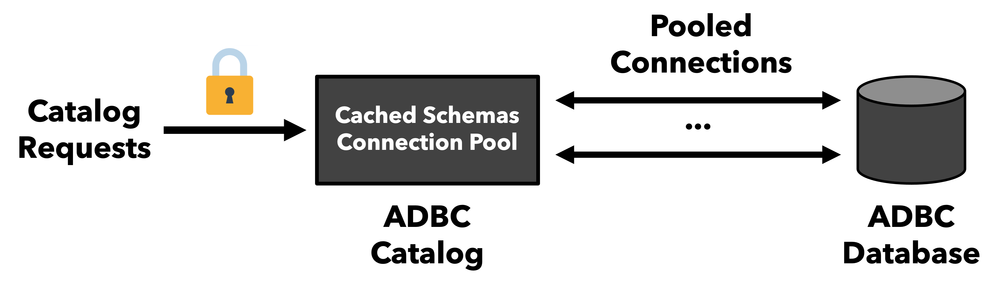
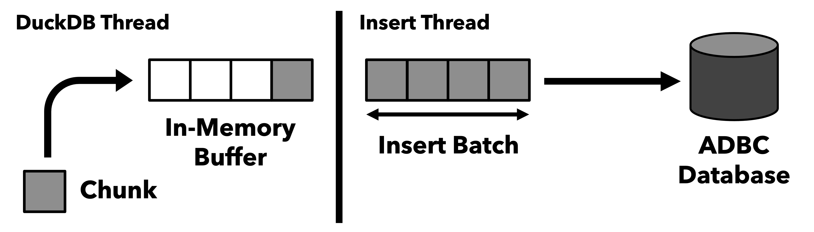

# ADBC Extension Design

## ADBC Catalog

An `ATTACH` command creates an ADBC catalog, which allows SQL statements to operate against the ADBC database as if it were local to DuckDB.
SQL statements on ADBC tables create catalog requests (schema/table lookups, connection requests, etc.), which the extension runs concurrently,
serializing access to any shared state using a `std::mutex`. 

To avoid redundant requests to the remote ADBC database, the catalog performs caching at two levels:

1. Previously accessed schema/table metadata is cached in the ADBC catalog.
2. Previously used connections are returned to a connection pool to serve future connection requests.

When a user executes a command that requests all catalog information (i.e., `SHOW ALL TABLES`), the ADBC extension will query the ADBC database for any metadata that misses the cache.

## ADBC Inserts

To avoid materializing the entire set of input rows to an `INSERT` or `CTAS` statement at once, the ADBC extension inserts batches of rows at a time. 
During query execution, a single DuckDB thread appends DuckDB chunks of 2048 rows into an in-memory buffer (single-producer single-consumer queue).
The buffer is full when it occupies 50% of available temporary memory, or it holds `abdc_insert_buffer_size` chunks.
When the buffer is full, the DuckDB thread signals the consuming insert thread to consume the buffer.
The insert thread consumes chunks from the in-memory buffer, converts them to Arrow format, and bulk-inserts them via ADBC.
After emptying the buffer, the insert thread signals back to DuckDB to append more chunks or exits if there is more data left to insert.
